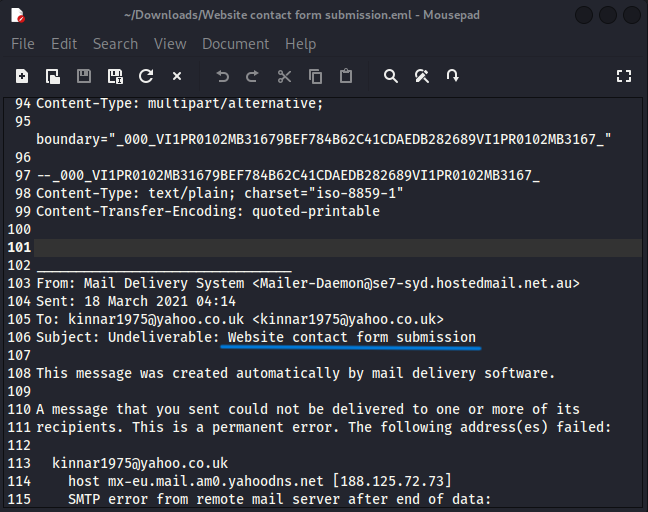
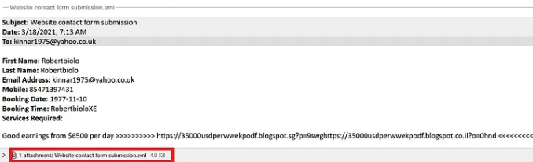
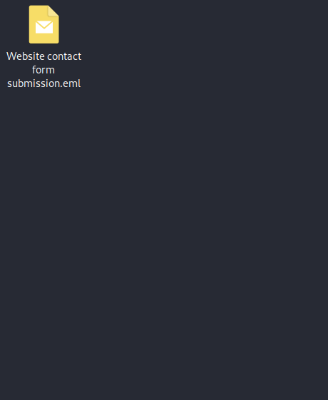
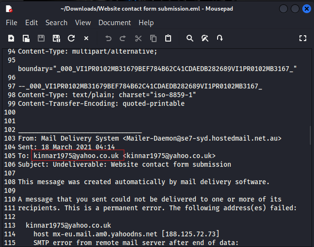
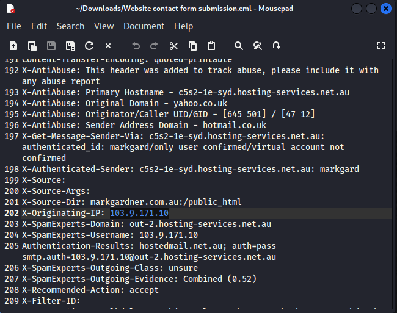
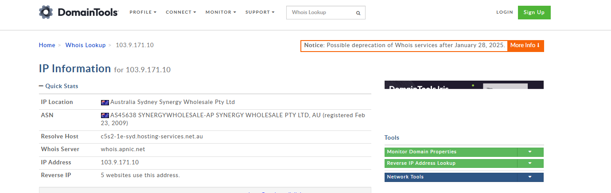
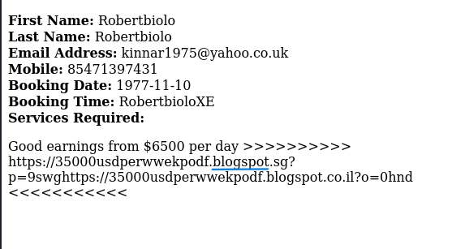
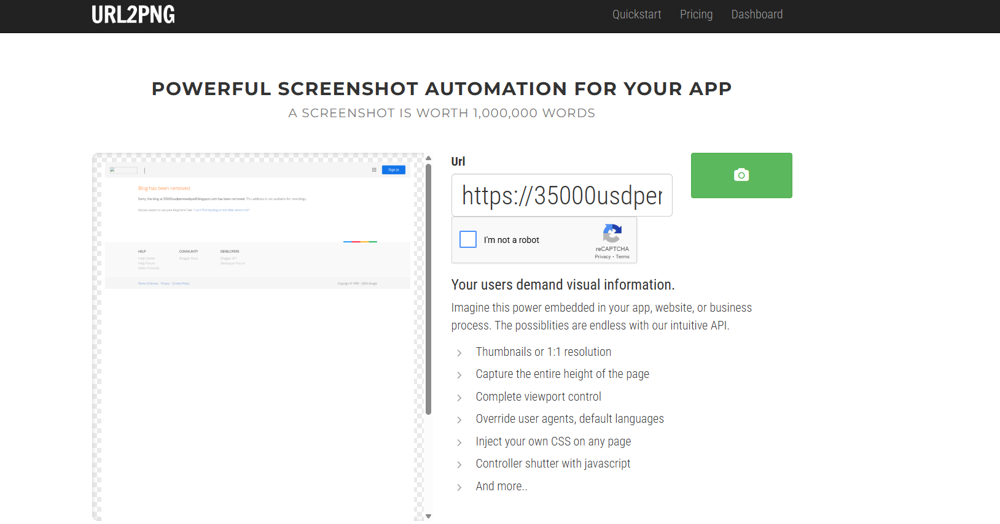

# website-contact-scam-documentation

# Website Contact Form Scam Documentation

## Overview
This repository archives proof of a suspicious (likely scam/spam) contact form submission received on **March 18, 2021**. The submission included fake personal details, an unrealistic earnings promise ("Good earnings from $6500 per day"), and a malformed Blogspot link (now removed by Google). The outbound notification email bounced permanently, confirming an invalid sender address.

**Goal**: Serve as tamper-evident documentation with raw `.eml` file + annotated screenshots for analysis, reporting, or security reference.

## Files Included
- **data/Website contact form submission.eml** — Original raw email file (view in Thunderbird, Outlook, etc.)
- **screenshots/** folder with visual proof (all filenames preserved as provided):

## Visual Proof & Evidence Breakdown

### 1. Email Subject & Overview

### 2. Date and Time Sent

### 3. Attached / Original File Reference

### 4. Sample Email Content for Analysis
Full extracted form submission showing fake name, email, mobile, nonsense booking date, and scam earnings pitch with garbled URL.

### 5. Bounce Notification – Permanent Failure
The message bounced with SMTP error from Yahoo's MX server (invalid recipient).

### 6. Originating IP Address
IP: 103.9.171.10 (Synergy Wholesale Pty Ltd, Australia hosting – often linked to spam activity).

### 7. Resolved Host from WHOIS / Domain Info
Primary hostname and hosting details.

### 8. Hosting Service Identification
Confirmation of the hosting provider used by the spam source.

### 9. Extracted Scam URL from Attachment
The malformed link hidden in the submission (`https://35000usdper...blogspot...`).

### 10. URL2PNG Capture of Scam Link
Screenshot of the now-removed Blogspot page captured safely via URL2PNG tool (shows "Blog has been removed").

## Key Red Flags Summary
- Fake / nonsense data: "Robertbiolo Robertbiolo", booking 1977-11-10, garbled link
- Scam lure: "$6500 per day" earnings promise
- Bounce: Permanent SMTP error – `kinnar1975@yahoo.co.uk` invalid
- Origin: Australian hosting IP with abuse/spam headers
- Link destination: Removed Blogspot (typical for disposable scam/phishing pages)

## Recommendations
- Use reCAPTCHA v3 or hCaptcha on contact forms
- Server-side validation: reject future/past absurd dates, suspicious keywords
- Rate-limit submissions per IP
- Log & monitor for similar patterns

